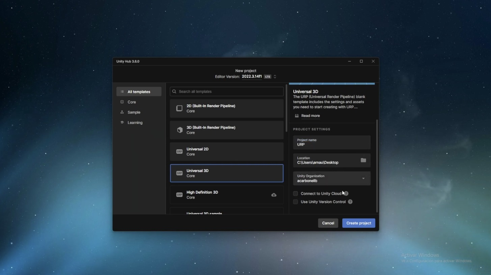

# FSM Unity Framework Tutorial

## Introduction

Welcome to the FSM Unity Framework Tutorial! In this tutorial, we will walk you through the process of using the FSM Unity Framework to create and manage finite state machines in your Unity projects.

## Video Tutorial

Click on the image above to watch the video tutorial.
