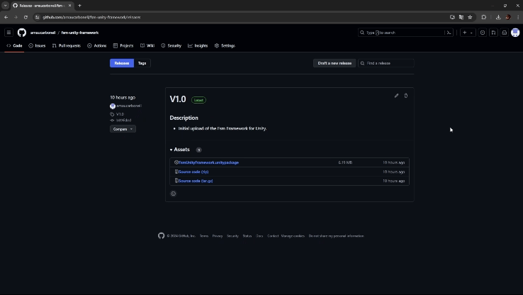
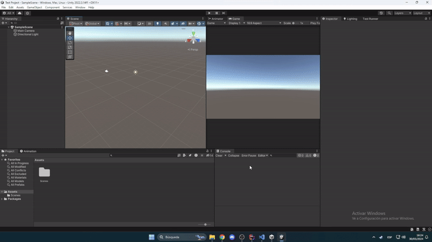

# Getting Started with FSM Unity Framework

Welcome to the FSM Unity Framework! This framework is designed to help developers implement finite state machines in their Unity projects efficiently. With a user-friendly interface and powerful features, you can easily manage complex game states and transitions.

## Installation Process

For the installations process you have to follow this steps:

In this GitHubRepository you will find the lates release of the package. You just need to download the file called FsmUnityFramework.unitypackage.

**Go to this GitHub Repository**: https://github.com/arnaucarbonell/fsm-unity-framework/releases

Once this is done open your unity project. Next, you have to execute the unitypackage by double clicking the downloaded element. In you Unity project, a new package will appear with all the folders inside the package and select all the components you want to import.

The final step is to install URP to your Unity project and add the _URP render pipeline. If your project already has URP, you can skip this last step.

Now you have the FSM Unity Framework imported!!!